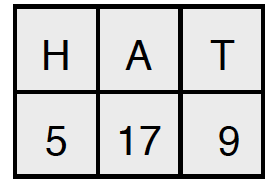

# AffineVigenere
This question introduces a cryptosystem which is a more complex version of Vigenère, called AffineVigenere. To encrypt with AffineVigenere, you use a key as in Vigenere, but also associate each letter of the key with a multiplier. For example, a key in AffineVigenere might be

--

Thus H is associated with the multiplier 5, A is associated with 17, and T is associated with
9. To encrypt: A letter of the plaintext is encrypted by first multiplying it by the multiplier, and then adding the offset from the key, taking the result modulo 26. For example, if the first element of the key is used, the multiplier is 5 and the key letter is H (value 7), then the plaintext letter E (value 4) encrypts to ((4*5) + 7) % 26 = 1 = ciphertext letter B.
Hence each place in the key corresponds to a particular kind of substitution, known as an affine substitution. For example, offset letter H and multiplier 5 give the following substitution:A plaintext is encrypted by repeating the key to the length of the plaintext, and then encrypting each letter in turn. For example, here is the encryption of `Gulliver’ with the key

